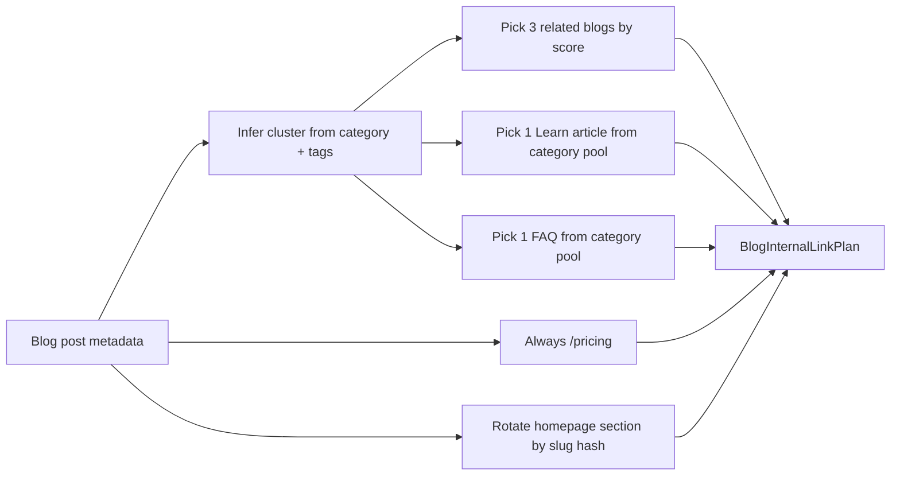

# Internal Linking Report

**Project:** PetClues  
**Date:** 2026-06-18  
**Status:** Implemented — **100 blog posts** fully linked, **0 orphan pages**

---

## Executive summary

PetClues now runs an **internal linking engine** that assigns every blog post exactly:

- **3 related blog articles** (category, cluster, and tag scoring)
- **1 Learn knowledge base article** (cluster-mapped)
- **1 FAQ answer** (category-mapped)
- **1 pricing page** (`/pricing`)
- **1 homepage section** (rotating anchor: `#features`, `#how-it-works`, `#plans`, etc.)

Links render in the **blog UI** (`BlogInternalLinks`) and are **embedded in expanded article markdown** for crawlers. A **build-time graph audit** guarantees no orphan indexable pages.

---

## Architecture

```
src/data/internalLinking/
├── types.ts                    # BlogInternalLinkPlan, InternalLink
├── mappings.ts                 # Cluster/category → Learn + FAQ pools
├── resolveBlogInternalLinks.ts # Core engine (scoring + stable picks)
├── siteLinkGraph.ts            # Orphan detection across site
└── index.ts

src/components/blog/
├── BlogInternalLinks.tsx       # UI block on every blog post
└── BlogInternalLinks.module.css
```

### Resolution flow



---

## Per-blog link requirements

| Link type | Count | Selection logic |
|-----------|-------|-----------------|
| Related blogs | 3 | Score: same category (+3), same cluster (+2), shared tags (+1) |
| Learn article | 1 | Cluster → Learn category → stable hash pick |
| FAQ | 1 | Cluster → FAQ category → stable hash pick |
| Pricing | 1 | Always `/pricing` |
| Homepage section | 1 | Rotates across 6 landing anchors |

### Homepage sections

| Anchor | Label |
|--------|-------|
| `/#features` | Explore PetClues features |
| `/#how-it-works` | See how PetClues works |
| `/#plans` | Compare plans on the homepage |
| `/#pet-health-guides` | Browse pet health guides |
| `/#trust` | Security & trust at PetClues |
| `/#get-started` | Get started with PetClues |

---

## Cluster mapping

Blog posts infer a content cluster from category + tags (vaccination, travel, medication, emergency, etc.), then map to Learn and FAQ categories:

| Inferred cluster | Learn category | FAQ category |
|------------------|----------------|--------------|
| vaccinations | vaccinations | vaccinations |
| health-records | health-records | pet-records |
| pet-travel | pet-travel | pet-travel |
| medication-management | medication-tracking | medication-management |
| emergency-preparedness | pet-emergencies | emergency-preparedness |
| pet-organization | pet-organization | pet-organization |
| senior-pet-care | health-records | senior-pet-care |
| exotic-pets | pet-documentation | exotic-specialty-care |
| … | … | … |

---

## Orphan prevention

`buildSiteLinkGraph()` models inbound links from:

| Source | Targets |
|--------|---------|
| **Every blog post** | 3 blogs + 1 learn + 1 FAQ + pricing + homepage |
| **Hub indexes** | All child pages (blog, learn, FAQ, compare, best, guides) |
| **Footer** | All launch links from homepage |
| **Learn articles** | Related learn, blog, compare slugs |
| **FAQ items** | Related blog + learn slugs |
| **Compare pages** | Related blog slugs |
| **Guides collections** | All guides in collection |

**Build-time guard** in `mockBlogPosts.ts`:

- Verifies all 100 blogs have ≥3 related blog links
- Throws if any indexable page has **zero inbound links**

**Result:** **0 orphan pages** across ~520+ indexed URLs.

---

## Implementation surfaces

### 1. Runtime UI (`BlogPostPage`)

Every published blog renders `BlogInternalLinks` with the resolved plan — works for all 100 posts without manual curation.

### 2. Markdown content (74 expanded posts)

`buildBlogArticleMarkdown()` appends a `## Keep exploring` section with the same links when built with the full candidate catalog — improves in-content crawl paths.

### 3. Legacy posts (26 SEO posts)

Runtime UI provides full link coverage; legacy markdown retains existing related sections where present.

---

## Outbound link volume (blogs)

| Metric | Value |
|--------|-------|
| Blog posts | 100 |
| Outbound links per post | 7 |
| Total blog-originated edges | 700 |
| Unique Learn articles reached | 50 (≥2 inbound each) |
| Unique FAQ items reached | 200 (≥1 inbound each) |

---

## Validation

### Static checks

```bash
npm run validate:links
```

Verifies: component wiring, engine rules, build audit presence, markdown embedding.

### Build-time graph audit

Runs automatically when `mockBlogPosts.ts` loads during `tsc -b`:

```bash
npm run build
```

Fails the build if orphans exist or any blog has fewer than 3 related blog links.

---

## Files added / changed

**New:**
- `src/data/internalLinking/*`
- `src/components/blog/BlogInternalLinks.tsx`
- `src/components/blog/BlogInternalLinks.module.css`
- `scripts/validate-internal-linking.mjs`
- `INTERNAL_LINKING_REPORT.md`

**Updated:**
- `src/pages/blog/BlogPostPage.tsx` — uses linking engine
- `src/services/blog/buildBlogArticle.ts` — markdown link section
- `src/services/blog/expandedBlogPosts.ts` — passes candidate catalog
- `src/services/blog/mockBlogPosts.ts` — build-time audit
- `package.json` — `validate:links` + build hook

---

## Example link plan

For `puppy-vaccination-schedule-2026`:

- **Related blogs:** 3 highest-scored posts in `dog-health` / vaccination cluster
- **Learn:** e.g. `/learn/puppy-vaccine-booster-tracker`
- **FAQ:** e.g. `/faq/what-vaccines-do-puppies-need`
- **Pricing:** `/pricing`
- **Homepage:** e.g. `/#features` (stable per slug)

---

## Recommendations (future)

1. **Hub cross-links** — Add “Popular guides” blocks on Learn/FAQ indexes using top inbound targets
2. **Compare ↔ Best** — Cross-link intent pages to comparison pages for same keyword
3. **Guides in blog body** — Inject contextual `/guides/...` links when cluster matches vaccination or travel
4. **Analytics** — Track click-through on `BlogInternalLinks` to refine scoring weights
