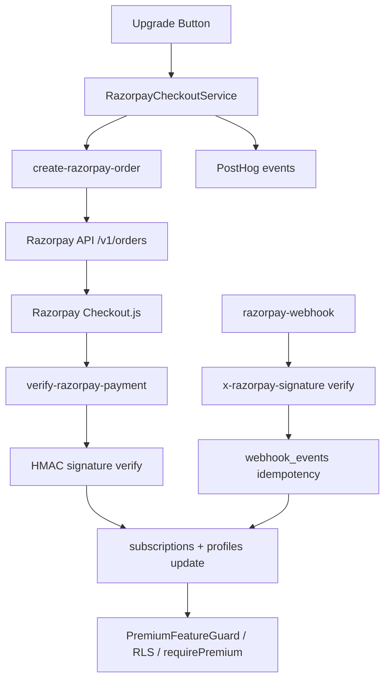

# PetClues Razorpay V1 Implementation Report

Generated: 2026-06-08

## Architecture



## Database Changes

**Migration:** `supabase/migrations/20250608100000_razorpay_subscriptions.sql`

| Change | Detail |
|--------|--------|
| `profiles.subscription_plan` | default `'free'` |
| `profiles.subscription_status` | default `'inactive'` |
| `subscriptions` | Razorpay schema (replaces Stripe columns) |
| `webhook_events` | Audit + idempotency |
| Dropped | `stripe_customers`, `stripe_webhook_events` |
| Updated | `sync_profile_subscription_tier()`, vet bill RLS |

## Edge Functions Created

| Function | Auth | Purpose |
|----------|------|---------|
| `create-razorpay-order` | JWT | Create ₹299 order, return `orderId` + `razorpayKey` |
| `verify-razorpay-payment` | JWT | HMAC verify + activate subscription |
| `razorpay-webhook` | Webhook signature | `payment.captured` / `payment.failed` |

## Frontend Changes

| File | Change |
|------|--------|
| `src/services/payments/razorpayCheckoutService.ts` | **New** - Checkout.js flow |
| `src/services/subscription/supabaseSubscriptionService.ts` | Razorpay integration |
| `src/subscription/featureGates.ts` | Extended features + `hasPremiumAccess()` |
| `src/components/subscription/PremiumFeatureGuard.tsx` | **New** |
| `src/pages/subscription/BillingPage.tsx` | Dynamic billing |
| `src/pages/subscription/PricingPage.tsx` | Pro ₹299 only |
| `src/data/subscriptionData.ts` | INR pricing |

## Stripe Removal

✅ All Stripe edge functions and `_shared/stripe/` deleted  
✅ No Stripe npm dependency  
✅ No Stripe code in `src/`

## Security Checks

See [PAYMENT_SECURITY_AUDIT.md](./PAYMENT_SECURITY_AUDIT.md)

## PostHog Events

| Event | Properties |
|-------|------------|
| `premium_checkout_started` | plan, amount, user_id |
| `premium_payment_success` | plan, amount, user_id |
| `premium_payment_failed` | plan, amount, user_id, reason |
| `premium_subscription_activated` | plan, amount, user_id |

## Build Status

```
npm run build - ✅ PASS
```

## Remaining Manual Steps

1. **Run migration** on Supabase production database
2. **Deploy edge functions:**
   ```bash
   supabase functions deploy create-razorpay-order
   supabase functions deploy verify-razorpay-payment
   supabase functions deploy razorpay-webhook
   ```
3. **Set Supabase secrets** (already exist per user): `RAZORPAY_KEY_ID`, `RAZORPAY_KEY_SECRET`, `RAZORPAY_WEBHOOK_SECRET`
4. **Set Vercel env vars:**
   ```
   VITE_RAZORPAY_KEY_ID=<same as RAZORPAY_KEY_ID>
   VITE_PAYMENTS_ENABLED=true
   ```
5. **Configure Razorpay webhook** → `https://jjrmxdxswelusrtcvsjf.supabase.co/functions/v1/razorpay-webhook`
6. **Test end-to-end** per [RAZORPAY_TESTING_GUIDE.md](./RAZORPAY_TESTING_GUIDE.md)
7. **Commit + push** this implementation

## Related Reports

- [RAZORPAY_AUDIT_REPORT.md](./RAZORPAY_AUDIT_REPORT.md)
- [PREMIUM_FEATURE_MATRIX.md](./PREMIUM_FEATURE_MATRIX.md)
- [PAYMENT_SECURITY_AUDIT.md](./PAYMENT_SECURITY_AUDIT.md)
- [RAZORPAY_TESTING_GUIDE.md](./RAZORPAY_TESTING_GUIDE.md)
