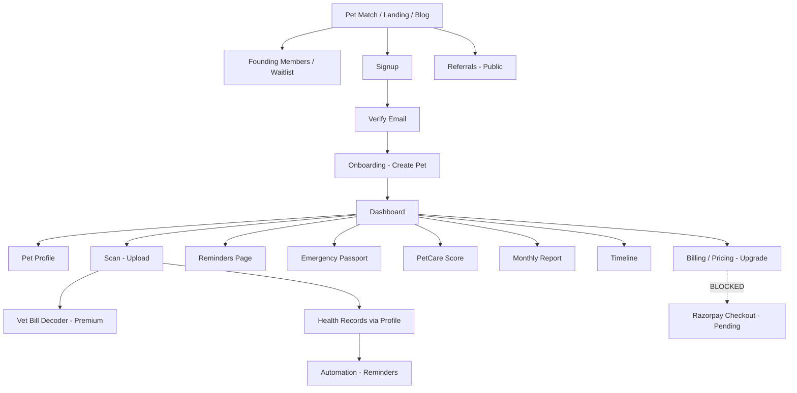

# PetClues Feature Flow Verification & Implementation Audit

**Date:** June 2, 2026  
**Scope:** Pre-deployment functional check - verify, repair wiring, report blockers  
**Source of truth:** `source-code/` codebase  
**Payment path:** Razorpay is the intended production path; Stripe edge functions exist as legacy only.

---

## 1. Executive summary

PetClues is a **feature-complete SPA** (React 19 + Vite + Supabase) with a coherent acquisition → auth → onboarding → dashboard → care loop. Core data paths (pets, documents, health records, reminders, score, passport, monthly report, vet decoder) are **wired to Supabase** when `VITE_SUPABASE_URL` and `VITE_SUPABASE_ANON_KEY` are set.

**Fixed in this audit (small wiring only):**
- Dashboard family widget no longer says “Luna” - uses active pet name.
- Lost Pet activation stores **real pet identity** (name, breed, initials).
- Age Translator reads **owned pets** from `PetProvider` instead of mock Luna profile.
- Sidebar hides **internal/dev routes** from normal navigation.
- Billing copy references **Razorpay pending** instead of Stripe portal.

**Deployment verdict: NOT YET - deploy after blockers below.**  
The app is usable for beta with **manual premium** (`profiles.subscription_tier = premium`) and configured secrets. Production launch should wait on **Razorpay billing**, **email cron verification**, and clearing **intentional mocks** called out in §6–§8.

---

## 2. Full feature inventory table

| Feature | Route / location | Purpose | Input | Output | Data source | Services | Dynamic? | Access | Tier | Deps | Wired? |
|--------|------------------|---------|-------|--------|-------------|----------|----------|--------|------|-----|--------|
| Pet Match Engine | `/pet-match` | Acquisition; breed/species fit quiz | Questionnaire answers | Recommendations, lead optional | Local engine + optional lead storage | `petMatchEngine`, `petMatchLeadService` | Yes (computed) | Public | Free | Supabase optional | ✅ Full |
| Landing | `/` | Education & conversion | - | Marketing sections | Static copy | Landing components | Static copy | Public | Free | - | ✅ Full |
| Pricing | `/pricing` | Plan comparison | - | Plan cards, CTA | `subscriptionData` | `SubscriptionProvider` | Static prices | Public | Free | Stripe fn (legacy) | ⚠️ UI only checkout |
| Founding Members | `/founding-members` | Early adopter capture | Email, ref params | Signup row / local fallback | Supabase `founding_members` or localStorage | Edge `founding-member-signup` | Yes | Public | Free | Supabase | ✅ Full |
| Signup | `/signup` | Account creation | Email, password, name | Session / verify pending | Supabase Auth | `supabaseAuthService` | Yes | Guest | Free | Supabase | ✅ Full |
| Login | `/login` | Sign in | Credentials | Session | Supabase Auth | `supabaseAuthService` | Yes | Public | Free | Supabase | ✅ Full |
| Verify email | `/verify-email` | Email confirmation | - | Verified user | Supabase Auth | Auth provider | Yes | Public | Free | Supabase | ✅ Full |
| Onboarding | `/onboarding` | First pet | Pet form | `pets` row | Supabase | `PetProvider` | Yes | Protected | Free | Supabase | ✅ Full |
| Dashboard | `/dashboard` | Live overview | Active pet + records | Widgets, journey, activity | Supabase + activity log | Multiple providers | Yes | Protected | Free | Supabase | ✅ Full |
| Pet Profile | `/pet-profile` | Identity + health hub | Pet, records | Edits, health sections | Supabase | `PetProvider`, `HealthRecordProvider` | Yes | Protected | Free | Supabase | ✅ Full |
| Scan / vault | `/scan` | Upload documents | Files | `pet_documents` + storage | Supabase storage | `DocumentProvider` | Yes | Protected | Free vault | Supabase | ✅ Full |
| Vet Bill Decoder | `/scan` (premium) | AI extract vet docs | Document bytes | `vet_bill_extractions` | OpenRouter via edge | `decode-vet-document` | Yes | Protected | **Premium** | OpenRouter secret | ✅ Full |
| Health Records | `/pet-profile` (no separate route) | Structured care history | CRUD forms | `health_records` | Supabase | `HealthRecordProvider` | Yes | Protected | Free | Supabase | ✅ Full |
| Emergency Passport | `/emergency-passport` | Emergency summary | Pet, records, docs | Passport view | Live aggregation | `passportService` | Yes | Protected | Free | Supabase | ✅ Full |
| Reminders | `/reminders` | Care schedule | CRUD | `reminders` | Supabase | `ReminderProvider` | Yes | Protected | Free | Supabase | ✅ Full |
| Automation Engine | (on health record create) | Auto reminders | Health record | Reminder + activity | Rules in code | `automationEngine` | Yes | Protected | Free | Supabase | ✅ Full |
| Timeline | `/timeline` | Life story | Records, docs, reminders | Events | Built dynamically | `timelineBuilder` | Yes* | Protected | Free | Supabase | ✅ Full |
| PetCare Score | `/pet-care-score` | Deterministic score | Records, reminders, docs | Score + factors | Engine | `petCareScoreEngine` | Yes | Protected | Free / premium insights | Supabase | ✅ Full |
| Monthly Report | `/monthly-report` | Shareable summary | Month + live data | Card, PNG, archive | Engine + localStorage archive | `MonthlyReportEngine` | Yes | Protected | Free gen | Supabase | ✅ Full |
| Referrals | `/referrals` | Invite loop | Email invites | Codes, referrals rows | Supabase | `referralService`, edge fns | Yes | Public page | Free | Supabase, Resend | ✅ Full |
| Blog / SEO | `/blog`, `/blog/:slug` | Acquisition content | - | Posts, meta, OG | `blog_posts` or mock | `supabaseBlogRepository` | Yes if DB seeded | Public | Free | Supabase | ✅ Full |
| Species Intelligence | (no UI route) | Knowledge layer | Species/breed slug | Guidelines, context | `species`, `breeds`, `care_guidelines` | `speciesKnowledgeRepository` | Yes if DB seeded | N/A (backend) | Free | Supabase | ✅ Data layer only |
| Premium gating | Feature gates + UI | Limit free tier | `subscription_tier` | Access booleans | `profiles` | `SubscriptionProvider` | Yes | Protected | Tier-based | Supabase | ✅ Tier works |
| Billing / upgrade | `/billing`, modals | Upgrade & manage | Plan choice | Checkout redirect | Profile + legacy Stripe tables | `supabaseSubscriptionService` | Partial | Protected | - | **Razorpay pending** | ⚠️ Blocker |
| Lost Pet Mode | `/lost-pet` | Recovery dashboard | Activate form | Case in localStorage | **Mock service** | `mockLostPetService` | Partial | Protected | Free | localStorage | ⚠️ Mock |
| Age Translator | `/age-translator` | Human-age metaphor | Pet birth date | Translation UI | **Owned pets** + deterministic utils | `AgeTranslatorProvider` | Yes (fixed) | Protected | Free | - | ✅ Full |
| Email infrastructure | Edge + cron | Reminder/summary emails | Jobs queue | Sent mail | `email_jobs`, Resend | `process-email-jobs` | Server-side | - | - | Resend, pg_cron | ⚠️ Verify cron |
| Settings | `/settings`, account/profile | Prefs | Forms | Saved prefs | Supabase / mock settings | `SettingsProvider` | Partial | Protected | Free | Supabase | ✅ Mostly |
| Notifications | `/notifications` | In-app feed | - | Notification list | **Mock** when no backend | `notificationService` | Mock | Protected | Free | - | ⚠️ Mock |
| Family sharing | `/family` | Caretakers | Invites | Caretaker list | **Mock** | `familySharingService` | Mock | Protected | Free | - | ⚠️ Mock |
| Waitlist | `/waitlist` | Pre-launch capture | Email | Waitlist entry | Local / optional | - | Partial | Public | Free | - | ✅ Page |
| Legal | `/privacy`, `/terms`, `/cookies` | Compliance | - | Static legal | Static | - | Static | Public | Free | - | ✅ Full |
| System status | `/status` | Ops transparency | - | Status copy | Static | - | Static | Public | Free | - | ✅ Full |
| Launch readiness | `/launch-readiness` | Internal QA | - | Checklist UI | Static | - | Static | Protected (hidden nav) | - | - | Dev only |
| Beta release / Analytics | `/beta-release`, `/analytics` | Internal | - | Placeholder dashboards | Mock analytics | `AnalyticsProvider` | Mock | Protected (hidden nav) | - | - | Dev only |

\* Timeline uses live data by default; mock only if `VITE_DEMO_TIMELINE=true`.

---

## 3. Story / flow map



| Step | Entry | Exit / CTA | Consumes | Produces | Success | Missing data |
|------|-------|------------|----------|----------|---------|--------------|
| 1 Pet Match | `/pet-match`, landing links | Signup or save lead | Answers | Match result | Result card | N/A public |
| 2 Landing | `/` | Signup, pricing, pet match | - | - | Hero CTAs | - |
| 3 Founding | `/founding-members` | Thank you / signup | Email | DB row | Badge on profile* | Supabase fn |
| 4 Auth | `/signup` → verify | Onboarding or dashboard | Credentials | Session | Dashboard | Redirect verify |
| 5 Onboarding | `/onboarding` | `/dashboard` | Pet form | `pets` | First pet active | Blocked until pet |
| 6 Dashboard | `/dashboard` | All quick actions | Active pet, reminders, score | - | Widgets populated | Empty state → onboarding |
| 7 Profile | `/pet-profile` | Save edits | Pet + records | Updates | Health summary | Empty pet state |
| 8 Scan | `/scan` | Decode (premium) | Files | Documents + extractions | Upload list | No pet → empty |
| 9 Health | Profile sections | - | Forms | `health_records` | List updates | - |
| 10 Passport | `/emergency-passport` | Lost pet CTA | Pet, records, docs | View | Live passport | Empty state |
| 11 Reminders | `/reminders` | Complete → dashboard | Reminders | Status updates | Lists | No pet |
| 12 Automation | On record create | Reminders refresh | Record type/dates | New reminder | Activity log | No-op if no rule match |
| 13 Email | Cron (server) | Inbox | `email_jobs` | Sent email | - | **Verify cron live** |
| 14 Score | `/pet-care-score` | - | Live sources | Score snapshot | Breakdown | Needs data for signal |
| 15 Monthly report | `/monthly-report` | Share/download | Month + live | PNG + archive | Card | Needs pet |
| 16 Referrals | `/referrals` | Invite | Email | referral rows | Dashboard | Auth for full features |
| 17 Blog | `/blog` | Post detail | Slug | SEO page | Rendered post | Seed migration |
| 18 Species | (API only) | - | Slug | Guidelines | Retrieval | No user UI |
| 19 Premium | Gates, `/billing` | Upgrade modal | Tier | Checkout URL | Premium features | **Razorpay not wired** |

---

## 4. Route map

### Public (no auth)
| Route | Page | Layout |
|-------|------|--------|
| `/` | Landing | Landing header |
| `/pricing` | Pricing | Public or app if logged in |
| `/pet-match` | Pet Match | Public |
| `/founding-members` | Founding Members | Public |
| `/blog`, `/blog/:slug` | Blog | Public + SEO |
| `/waitlist` | Waitlist | Public |
| `/referrals` | Referrals | Public |
| `/lost-pet/report` | Community sighting report | Public |
| `/login`, `/signup`, `/forgot-password`, `/verify-email`, `/auth/callback`, `/reset-password` | Auth | Minimal |
| `/privacy`, `/terms`, `/cookies`, `/status` | Legal / status | Public |

### Protected (auth + onboarding)
| Route | Page |
|-------|------|
| `/onboarding` | Onboarding (skips if complete) |
| `/dashboard` | Dashboard |
| `/pet-profile` | Pet Profile |
| `/scan` | Scan |
| `/timeline` | Timeline |
| `/reminders` | Reminders |
| `/lost-pet` | Lost Pet |
| `/age-translator` | Age Translator |
| `/pet-care-score` | PetCare Score |
| `/monthly-report`, `/monthly-report/archive` | Monthly Report |
| `/emergency-passport` | Emergency Passport |
| `/settings`, `/settings/account`, `/settings/profile` | Settings |
| `/notifications` | Notifications |
| `/family` | Family Access |
| `/billing` | Billing |

### Internal / dev (direct URL only - removed from sidebar)
| Route | Page |
|-------|------|
| `/launch-readiness` | Launch Readiness |
| `/beta-release` | Beta Release |
| `/analytics` | Analytics |
| `/waitlist` | Also public |
| `/pet-match` | Also public |

**Nav:** `PRIMARY_NAV` = Dashboard, Reminders, Profile, Scan, Timeline, Passport.  
**No orphan routes found.** `*` → `NotFoundPage`.

**Auth guards:** `ProtectedRoute` → login; unverified → verify; needs onboarding → `/onboarding`.

---

## 5. Dynamic data audit

| Area | Status | Notes |
|------|--------|-------|
| Active pet | ✅ Dynamic | `PetProvider` + Supabase `pets` |
| Dashboard status / insight | ✅ Dynamic | Score engine + activity log |
| Timeline | ✅ Dynamic default | Mock only with `VITE_DEMO_TIMELINE=true` |
| Dashboard activity | ✅ Dynamic default | Mock only with `VITE_DEMO_DASHBOARD=true` |
| Health records / passport | ✅ Dynamic | Same `HealthRecordProvider` source |
| Documents / scan list | ✅ Dynamic | `DocumentProvider` |
| Reminders | ✅ Dynamic | `ReminderProvider` |
| Monthly report | ✅ Dynamic | `MonthlyReportEngine` inputs |
| PetCare Score | ✅ Dynamic | Deterministic engine |
| Blog | ✅ Dynamic if Supabase + seed | Falls back to `mockBlogRepository` offline |
| Species intelligence | ✅ Dynamic if migrated | Falls back to mock repo offline |
| Vet decoder | ✅ Dynamic | Edge + OpenRouter |
| Subscription tier | ✅ Dynamic | `profiles.subscription_tier` |
| Notifications | ⚠️ Mock | `notificationService` → `notificationData` |
| Family sharing | ⚠️ Mock | localStorage caretakers |
| Lost Pet cases | ⚠️ Mock | localStorage, pet identity now correct |
| Age Translator pets | ✅ Fixed | Uses `ownedPets` from `PetProvider` |
| Pricing amounts | Static | `subscriptionData` / modal ($9/$79) - OK until Razorpay |

---

## 6. Hardcoded value audit

### Intentionally isolated (not used when Supabase + flags off)
- `src/data/demoData.ts` - opt-in via `VITE_DEMO_*`
- `src/data/timelineData.ts`, `dashboardData.ts` - demo/Luna samples
- `src/data/mockData.ts`, `profileData.ts`, `passportData.ts` - offline dev fixtures
- `src/services/vetBillDecoder/mockVetBillDecoder.ts` - only without Supabase
- `src/services/blog/mockBlogPosts.ts` - offline blog
- `src/services/speciesIntelligence/mockSpeciesData.ts` - offline knowledge

### Previously user-facing (fixed this audit)
- ~~FamilySharingWidget “Luna”~~ → active pet name
- ~~Lost Pet case always Luna~~ → active pet on activate
- ~~Age Translator always Luna profile~~ → owned pets

### Still mock on user-facing pages (documented, not silent)
| Surface | Hardcoded source | Should use |
|---------|------------------|------------|
| Notifications page | `notificationData` | Future Supabase notifications table |
| Family Access | `familySharingData` | Future caretakers API |
| Lost Pet persistence | localStorage | Future `lost_pet_cases` table |
| Supported doc types list | `scanData` | OK as static config |
| Permission definitions | `familySharingData` | OK as static config |

### No remaining “Luna” on live dashboard/profile/passport paths when Supabase is configured.

---

## 7. Feature-by-feature status

| Feature | Status | Notes |
|---------|--------|-------|
| **A Pet Match** | ✅ Pass | Questionnaire → engine → result; signup CTA when logged out |
| **B Auth** | ✅ Pass | Signup, login, verify, callback, reset; session propagates |
| **C Onboarding** | ✅ Pass | Creates pet → dashboard; `needsOnboarding` gate |
| **D Dashboard** | ✅ Pass | Live pet, reminders, score, journey, activity (non-demo) |
| **E Pet Profile** | ✅ Pass | Dynamic identity; health CRUD; vault sections |
| **F Scan** | ✅ Pass | Upload to `pet-documents`; recent list; decoder history |
| **G Health Records** | ✅ Pass | CRUD; links `sourceDocumentId`; profile summary |
| **H Emergency Passport** | ✅ Pass | `buildPassportSummary` from live data; export placeholder labeled |
| **I Reminders** | ✅ Pass | Pet-linked; overdue/upcoming; dashboard widgets |
| **J Automation** | ✅ Pass | Vaccination/medication rules; dedupe by note tag; activity log |
| **K Email** | ⚠️ Verify | Tables + edge fn exist; confirm pg_cron + Resend on remote |
| **L PetCare Score** | ✅ Pass | Deterministic; updates with new data |
| **M Monthly Report** | ✅ Pass | Live counts, score delta, export/share, archive |
| **N Founding Members** | ✅ Pass | Edge fn + fallback; badge via profile |
| **O Referrals** | ✅ Pass | Code gen, invite, attribution; conversion tied to legacy Stripe webhook |
| **P Blog / SEO** | ✅ Pass | Index, slug, meta, OG, categories; needs seeded posts |
| **Q Species Intelligence** | ✅ Pass (layer) | No chatbot UI; repository + retrieval ready |
| **R Premium / Billing** | ❌ Blocker | Gates work with manual tier; checkout = legacy Stripe fns, **Razorpay not implemented** |

---

## 8. Provider order audit

```
AuthProvider
  └ SubscriptionProvider (reads user tier)
      └ PetProvider
          └ DocumentProvider
              └ ReminderProvider
                  └ HealthRecordProvider (uses Reminders for automation) ✅ order OK
                      └ GrowthProvider
                          └ LostPetProvider (uses Pets) ✅
                              └ AgeTranslatorProvider (uses Pets) ✅
                                  └ PetCareScoreProvider
                                      └ SettingsProvider
                                          └ NotificationProvider
                                              └ FamilySharingProvider
                                                  └ AnalyticsProvider
                                                      └ SEOProvider
```

- Auth hydrates before pets/subscription.
- Health records correctly sit inside ReminderProvider for automation refresh.
- No null-provider crashes identified in code paths reviewed.

---

## 9. Remaining blockers

| Priority | Blocker | Impact |
|----------|---------|--------|
| P0 | **Razorpay checkout & webhooks not implemented** | Upgrade/billing CTAs call Stripe edge functions; production payments blocked |
| P0 | **Referral conversion still hooks Stripe subscription sync** | Conversion may not fire until Razorpay sync replaces Stripe webhook path |
| P1 | **Email cron / Resend** | Must verify `process-email-jobs` scheduled on Supabase and templates tested |
| P1 | **Lost Pet** | localStorage mock - no multi-device persistence |
| P2 | **Notifications** | Mock data only |
| P2 | **Family sharing** | Mock caretakers - invites not persisted |
| P2 | **Blog / species seed** | Requires migrations applied on remote (`blog_posts`, species tables) |
| P3 | **Stripe references in repo** | Document as legacy; do not enable for launch |

### Environment (assumed configured per your note)
- `VITE_SUPABASE_URL`, `VITE_SUPABASE_ANON_KEY` - frontend
- `OPENROUTER_API_KEY` - `decode-vet-document`
- `RESEND_*` - email edge functions
- Manual premium: `profiles.subscription_tier = 'premium'`

---

## 10. Ready for deployment vs final verdict

### Ready now (with manual premium + secrets)
- Auth, onboarding, dashboard, profile, scan upload, health records, reminders, automation, passport, score, monthly report, timeline (non-demo), vet decoder, pet match, founding members, referrals UI, blog (if seeded), landing/legal.

### Not ready without
- Self-serve payment (Razorpay)
- Verified transactional email pipeline
- Optional: Lost Pet / family / notifications persistence

### Production build
- `npm run build` - **passes** (681 modules, no TS errors at audit time).

---

## Final verdict: **NOT DEPLOY** (production monetization)

**Deploy to staging / closed beta:** **YES**, if testers use manual premium and you accept mock family/lost-pet/notifications.

**Deploy to production (paid launch):** **NO** until Razorpay billing is wired and email cron is verified.

---

*Audit performed against `source-code/` on June 2, 2026. Small wiring fixes applied in the same pass; no new features, no UI redesign.*
