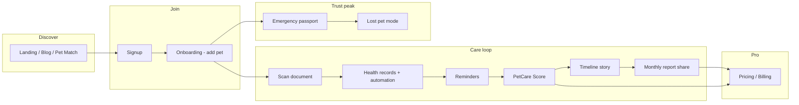
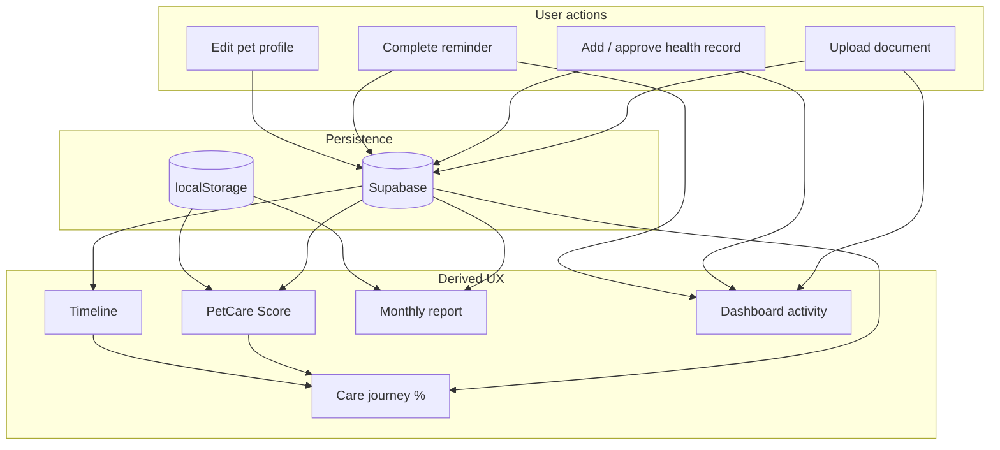

# PetClues Product Journey & Dynamic Data Audit

**Date:** June 2, 2026  
**Scope:** Feature inventory, data-source truth table, user journey, gaps vs Stripe, setup checklist  
**Build:** `npm run build` passes (679 modules)

---

## Executive summary

PetClues is a **full-feature SPA** with 35+ routes spanning acquisition, core care, growth, and ops. Most **core care features** read and write through Supabase when `VITE_SUPABASE_*` is set; several surfaces previously showed **mock or empty data** even after real user actions.

This pass:

- Turned off **demo mock data by default** (timeline, dashboard activity)
- Wired **Timeline** from health records, documents, reminders, and score history
- Wired **Dashboard** status, insights, and **Care Journey** from live inputs
- Fixed **Lost Pet** to use the authenticated user’s **active pet** (not hardcoded Luna)
- Logged **activity feed** entries when users upload docs, add records, or complete reminders

**Stripe / Pro checkout** remains intentionally deferred per your direction.

---

## 1. Feature inventory (by layer)

### Acquisition & SEO (public)

| Feature | Route | Dynamic data source | Pro hook |
|---------|-------|---------------------|----------|
| Landing | `/` | Static marketing | CTA → signup / pricing |
| Pet Match | `/pet-match` | Questionnaire + rule engine; leads in localStorage | “Create account” after results |
| Founding Members | `/founding-members` | Edge `founding-member-signup` or localStorage | Founding badge, trial tease |
| Blog | `/blog`, `/blog/:slug` | `blog_posts` table or mock seed | Content → signup |
| Waitlist | `/waitlist` | Supabase waitlist or mock | Early access |
| Referrals | `/referrals` | `referral_codes` / `referrals` or mock | Premium months (rewards not issued yet) |
| Pricing | `/pricing` | Static plans | Pro positioning (checkout when Stripe live) |
| Legal | `/privacy`, `/terms`, `/cookies` | Static placeholders | Trust |
| System Status | `/status` | Static labels (needs health API later) | - |

### Auth & onboarding

| Feature | Route | Dynamic data source |
|---------|-------|---------------------|
| Signup / Login | `/signup`, `/login` | Supabase Auth |
| Email verify | `/verify-email` | Auth session |
| Onboarding | `/onboarding` | Creates **pet** in `pets` table |

### Core app (protected)

| Feature | Route | Dynamic data source | Notes |
|---------|-------|---------------------|-------|
| Dashboard | `/dashboard` | Pets, reminders, score, activity log, journey | **Care Journey** card added |
| Pet profile | `/pet-profile` | `pets`, health records, documents | Edit persists to Supabase |
| Scan / documents | `/scan` | `pet_documents` storage + optional vet decode | Premium gates decode |
| Vet bill decoder | (in Scan flow) | Edge `decode-vet-document` + OpenRouter | Needs edge secrets |
| Health records | (profile + automation) | `health_records` | Automation → reminders |
| Reminders | `/reminders` | `reminders` | CRUD + complete |
| Timeline / Life Story | `/timeline` | **Built from records, docs, reminders, score** | Demo only if `VITE_DEMO_TIMELINE=true` |
| Emergency passport | `/emergency-passport` | Pet + records + documents | Share/export |
| PetCare Score | `/pet-care-score` | Computed from records, docs, reminders | History in localStorage |
| Monthly report | `/monthly-report` | Engine from live sources; archive in localStorage | Premium tease on export |
| Age translator | `/age-translator` | Active pet birth date | |
| Lost pet | `/lost-pet` | **Active pet** + localStorage service | Not yet Supabase-backed |
| Family sharing | `/family` | Mock / partial service | Needs RLS + invites DB |
| Notifications | `/notifications` | In-app list; email via edge | Resend secrets |
| Settings | `/settings` | Profile + preferences | |
| Billing | `/billing` | Stripe when configured | **Deferred** |

### Knowledge & intelligence (no UI yet)

| Layer | Access | Dynamic source |
|-------|--------|----------------|
| Species intelligence | `retrieveSpeciesKnowledge()` | `species`, `breeds`, `care_guidelines` |
| Blog CMS | `getBlogRepository()` | `blog_posts` |

### Internal / beta (hide in prod nav)

| Feature | Route |
|---------|-------|
| Launch readiness | `/launch-readiness` |
| Beta release | `/beta-release` |
| Analytics | `/analytics` |
| Beta feedback | `/beta-feedback` |

---

## 2. Intended user journey (story → Pro)



**Narrative:** Discover → sign up → add pet → **scan** (proof of value) → **records & reminders** (habit) → **score & timeline** (emotional payoff) → **monthly report** (shareable win) → **passport / lost pet** (crisis trust) → **Pro** for AI decode, unlimited exports, premium passport.

The **Care Journey** card on the dashboard encodes this path with completion % and “Continue” CTAs.

---

## 3. Data flow (what feeds what)



---

## 4. Dynamic vs mock - truth table

| Surface | Without Supabase env | With Supabase + migrations |
|---------|----------------------|----------------------------|
| Auth / pets / reminders / records / docs | Mock or limited | **Live** |
| Dashboard activity | Activity log (local) after actions | Same + DB-backed care data |
| Timeline | Empty unless demo flag | **Live aggregation** |
| PetCare Score | From loaded providers | **Live** |
| Blog / species KB | Mock seeds | **Live** after migration |
| Lost pet | localStorage per pet id | Still local (no migration yet) |
| Monthly report archive | localStorage | localStorage (DB later) |
| Referrals / founding | localStorage fallbacks | Edge functions |
| Stripe / Pro | UI only | Needs Stripe secrets |

**Demo flags (off by default):**

- `VITE_DEMO_TIMELINE=true` - Luna mock timeline
- `VITE_DEMO_DASHBOARD=true` - mock activity feed
- `VITE_DEMO_PROFILE_DOCS=true` - reserved for profile docs demo

---

## 5. What you need to do (excluding Stripe)

### Required for dynamic core app

1. **`.env` in `source-code/`**
   ```env
   VITE_SUPABASE_URL=https://jjrmxdxswelusrtcvsjf.supabase.co
   VITE_SUPABASE_ANON_KEY=<your-anon-key>
   VITE_SITE_URL=http://localhost:5173
   ```

2. **Apply all migrations** (pets, reminders, health_records, documents, subscriptions schema, referrals, founding, blog, species intelligence):
   ```bash
   cd source-code && npx supabase db push
   ```

3. **Supabase Auth** - enable email provider; set redirect URLs for `/auth/callback`.

4. **Storage bucket** - `pet-documents` (if not created by migration/policy scripts).

### Required for premium-adjacent features (not Stripe)

| Capability | Secrets / setup |
|------------|-----------------|
| Vet bill AI decode | `OPENROUTER_API_KEY` on edge; deploy `decode-vet-document` |
| Email reminders | `RESEND_API_KEY`, `RESEND_FROM_EMAIL`, `APP_BASE_URL` |
| Referral invites | Deploy `get-referral-code`, `send-referral-invite` |
| Founding signup | Deploy `founding-member-signup` |

### Recommended next engineering (not blocking demo)

| Gap | Impact |
|-----|--------|
| Lost pet → Supabase tables | Cross-device recovery cases |
| Timeline `timeline_events` table | Manual “add moment” + photos |
| Monthly report → DB archive | Persistent share history |
| Family sharing RLS + invites | Real multi-user |
| Activity log → `activity_events` table | Cross-device dashboard feed |
| System status | Real health checks |

### Explicitly deferred (your call)

- **Stripe** - `STRIPE_*` secrets, webhook, checkout/portal functions
- Reward issuance for referrals

---

## 6. Code changes in this audit pass

| Area | Change |
|------|--------|
| `demoData.ts` | Mock off by default |
| `timelineBuilder.ts` + `useTimelineData` | Live timeline |
| `careJourneyService` + `CareJourneyCard` | Journey on dashboard |
| `dashboardStatus.ts` | Status badge from score + overdue |
| `ImportantInsightCard` | No mock fallback |
| `LostPetProvider` / `LostPetPage` | Active pet |
| Activity log | On upload, record create, reminder complete |
| `AddEventModal` | Guides to Scan / Reminders |

---

## 7. Manual test script

1. Sign up → onboarding → create pet **Max** (not Luna).
2. Upload PDF on **Scan** → see document on profile; **Timeline** shows document event.
3. Add health record → **Timeline** care event; check **Reminders** for automation.
4. Complete a reminder → **Timeline** + **Dashboard** activity update.
5. Open **PetCare Score** → dashboard status and journey % increase.
6. Generate **Monthly report** → archive entry; journey step completes.
7. **Lost pet** inactive copy shows **Max**, not Luna.
8. Public **Blog** loads posts (Supabase or mock).

---

## 8. Pro temptation map (copy strategy)

| Moment | Free value | Pro tease |
|--------|------------|-------------|
| After scan | Store document | AI vet bill decode |
| Score &lt; 70 | Action list | “Unlock full breakdown” |
| Monthly report | One export | Unlimited + archive |
| Passport | Basic card | Premium layout / share |
| Journey step 8 | View pricing | Checkout when Stripe ready |

---

*Report generated as part of product journey audit. Stripe integration to be handled in a dedicated pass.*
