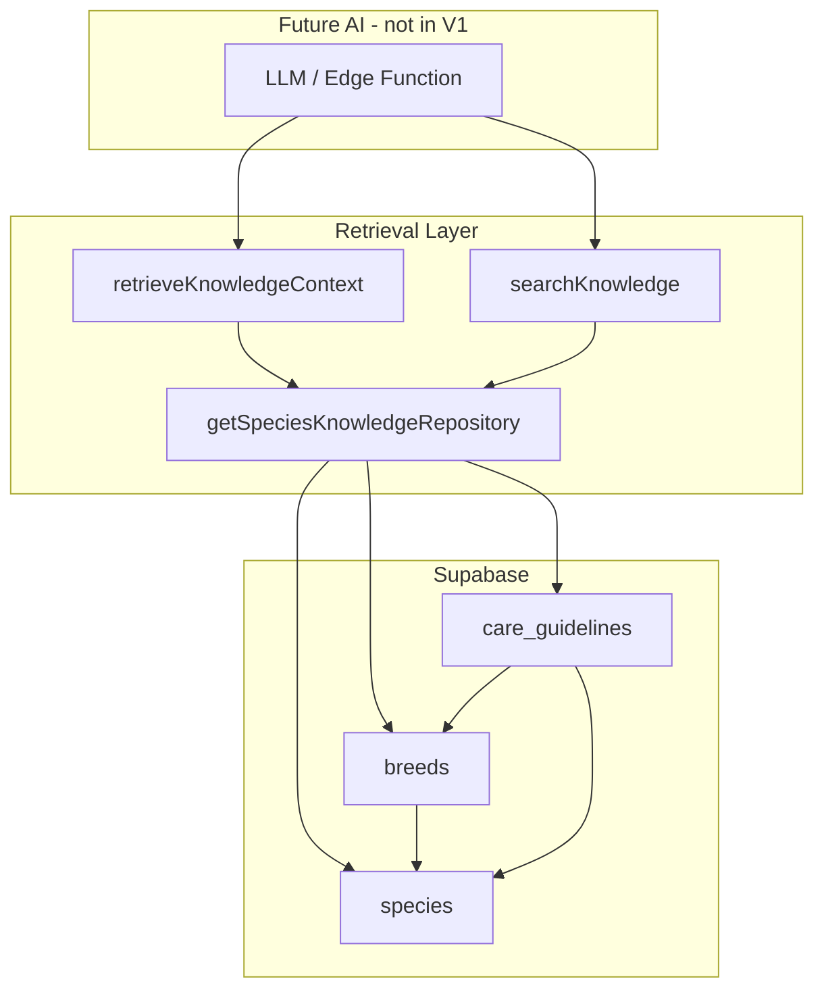

# PetClues Species Intelligence Report

**Date:** June 2, 2026  
**Scope:** Knowledge layer (`species`, `breeds`, `care_guidelines`) + retrieval services (no chatbot/companion UI)  
**Build status:** `npm run build` passes (673 modules)

---

## Executive Summary

Implemented the **Species Intelligence Foundation** — a structured PetClues knowledge layer that future AI features can query for grounded care context:

- Three relational tables with public read access
- Six care dimensions stored as typed JSONB (lifespan, diet, exercise, conditions, vaccines, seasonal)
- Repository-based retrieval with mock + Supabase adapters
- AI-ready `contextText` bundle via `retrieveSpeciesKnowledge()`
- Keyword search stub (vector/RAG upgrade path documented)

**Explicitly not built:** chatbot UI, companion persona, or conversational flows.

---

## Phase 1 — `species` table

**Migration:** `supabase/migrations/20250532300000_species_intelligence.sql`

| Column | Type | Notes |
|--------|------|-------|
| `slug` | text | Unique identifier (`dog`, `cat`, …) |
| `name` | text | Display name |
| `description` | text | Species overview |

**Seed:** dog, cat, bird, rabbit, reptile

---

## Phase 2 — `breeds` table

| Column | Type | Notes |
|--------|------|-------|
| `species_id` | uuid FK | Parent species |
| `slug` | text | Unique per species |
| `name` | text | Display name |
| `size_category` | text | `small` \| `medium` \| `large` \| `giant` \| `variable` |

**Seed:** 9 breeds (e.g. Labrador, Domestic Shorthair, Bearded Dragon)

---

## Phase 3 — `care_guidelines` table

| Column | Type | Notes |
|--------|------|-------|
| `species_id` | uuid FK | Required |
| `breed_id` | uuid FK | Optional — `null` = species default |
| `lifespan` | jsonb | Phase 4 |
| `diet` | jsonb | Phase 4 |
| `exercise_needs` | jsonb | Phase 4 |
| `common_conditions` | jsonb | Array |
| `vaccination_guidance` | jsonb | Phase 4 |
| `seasonal_considerations` | jsonb | Array |
| `version` | int | Schema versioning |
| `status` | text | `draft` \| `published` |

**Uniqueness:** Partial unique indexes — one species-default row per species, one row per breed.

**RLS:** Public read on `species`, `breeds`, and published `care_guidelines`.

---

## Phase 4 — Care knowledge fields

TypeScript models: `src/types/speciesIntelligence.ts`

| Field | Structure |
|-------|-----------|
| **Lifespan** | `minYears`, `maxYears`, `notes` |
| **Diet** | `summary`, `feedingFrequency`, `restrictions[]`, `notes` |
| **Exercise needs** | `level` (low/moderate/high), `minutesPerDay`, `activities[]` |
| **Common conditions** | `{ name, description, prevalence }[]` |
| **Vaccination guidance** | `core[]`, `optional[]`, `scheduleNotes`, `boosterNotes` |
| **Seasonal considerations** | `{ season, title, considerations[] }[]` |

**Resolution:** Breed-specific guideline wins; falls back to species default.

---

## Phase 5 — Retrieval services

**Entry point:** `getSpeciesKnowledgeRepository()` in `src/services/speciesIntelligence/index.ts`

### `SpeciesKnowledgeRepository` methods

| Method | Purpose |
|--------|---------|
| `listSpecies()` | All species |
| `getSpeciesBySlug(slug)` | Single species |
| `listBreedsBySpeciesSlug(slug)` | Breeds for species |
| `getBreed(speciesSlug, breedSlug)` | Single breed |
| `getCareGuidelines(speciesSlug, breedSlug?)` | Resolved care record |
| `retrieveKnowledgeContext({ speciesSlug, breedSlug? })` | **AI-ready bundle** |
| `searchKnowledge({ query, speciesSlug?, limit? })` | Keyword search |

### AI integration (future)

```typescript
import { retrieveSpeciesKnowledge } from '@/services/speciesIntelligence';

const ctx = await retrieveSpeciesKnowledge('dog', 'labrador-retriever');
if (ctx) {
  // ctx.contextText → LLM system prompt / RAG chunk
  // ctx.care → structured fields for tool calls
}
```

**Helpers:**

- `knowledgeContextBuilder.ts` — markdown-style `contextText`
- `knowledgeSearch.ts` — term scoring (replace with pgvector later)
- `knowledgeMappers.ts` — DB JSONB → typed models

**Adapters:**

- `supabaseSpeciesKnowledgeRepository.ts` — production
- `mockSpeciesKnowledgeRepository.ts` — offline parity

---

## Architecture diagram



---

## Deploy checklist

1. `npx supabase db push` — apply `20250532300000_species_intelligence.sql`
2. Verify seed: 5 species, 9 breeds, 8 care guidelines
3. Future: edge function `retrieve-species-knowledge` for server-side AI (optional)

---

## Test plan

- [ ] `retrieveSpeciesKnowledge('dog')` returns species-level context
- [ ] `retrieveSpeciesKnowledge('dog', 'labrador-retriever')` returns breed override (higher exercise, hip dysplasia)
- [ ] `searchKnowledge({ query: 'vaccination', speciesSlug: 'dog' })` returns scored matches
- [ ] Offline without Supabase env uses mock repository with same slugs
- [ ] No UI routes added (infrastructure only)

---

## Files added

| Path | Role |
|------|------|
| `supabase/migrations/20250532300000_species_intelligence.sql` | Schema + seed |
| `src/types/speciesIntelligence.ts` | Domain types |
| `src/services/speciesIntelligence/*` | Repository, mappers, search, context |
| `PetClues_Species_Intelligence_Report.md` | This document |

**Updated:** `src/services/supabase/database.types.ts`
